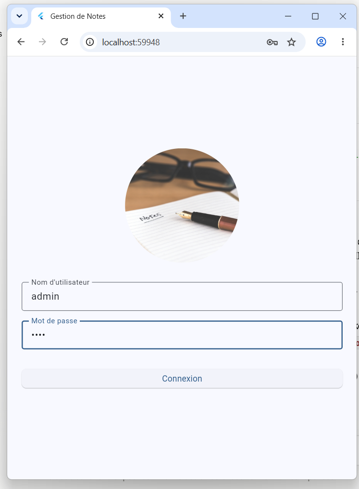
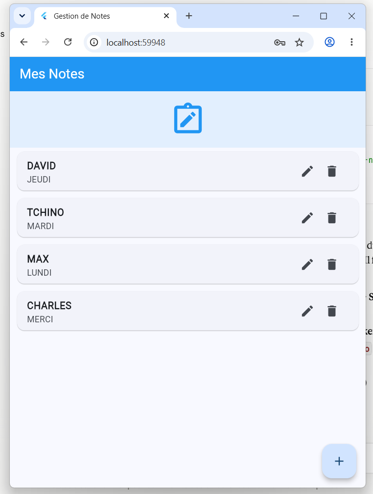
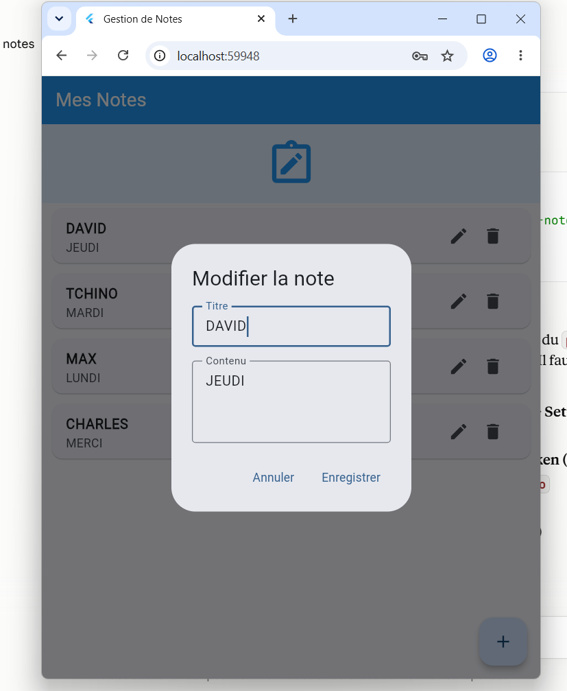
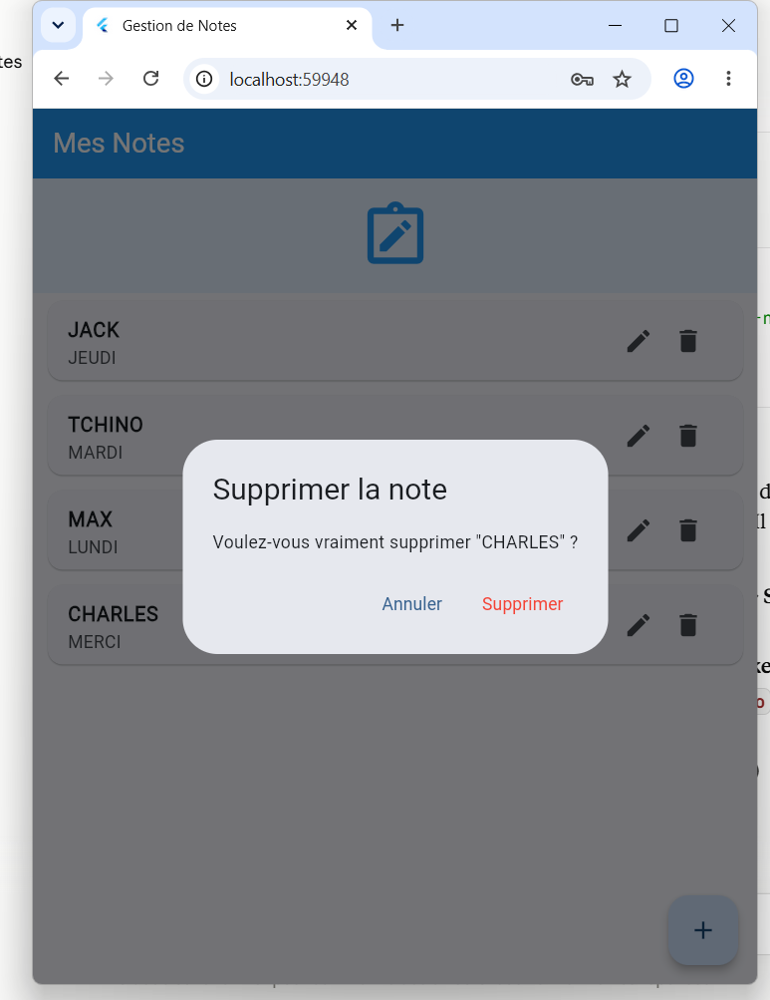
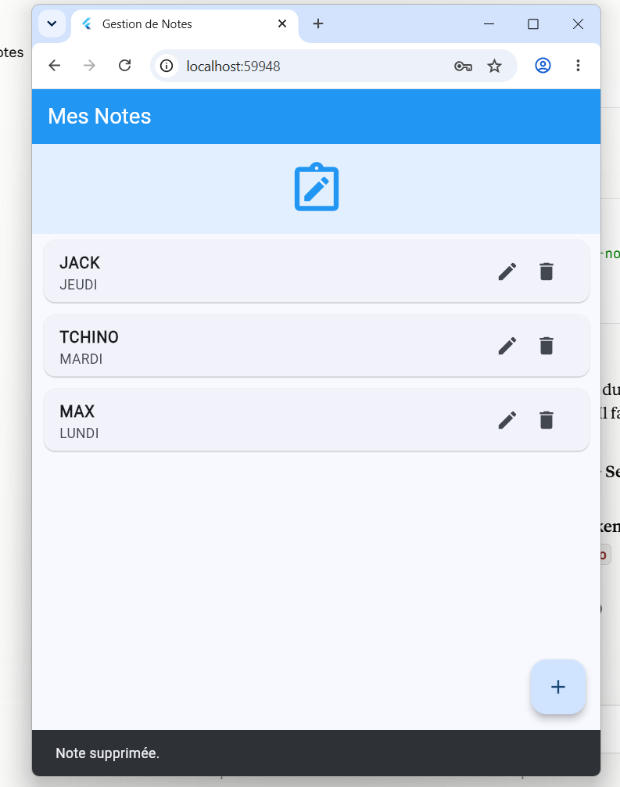

# Gestion de Notes — Application Flutter

## Description
Application mobile de gestion de notes personnelles, développée avec Flutter et SQLite, dans le cadre du projet D-Clic niveau intermédiaire.

## Captures d'écran

| Connexion | Liste des notes |
|---|---|
|  |  |

| Modifier une note | Supprimer une note |
|---|---|
|  |  |

| Confirmation de suppression |
|---|
|  |

## Prérequis
- Flutter SDK installé (`flutter doctor` sans erreur)
- VS Code avec l'extension Flutter

## Installation

1. Cloner ou télécharger le projet
2. Se placer dans le dossier du projet :
   ```bash
   cd gestion_notes
   ```
3. Installer les dépendances :
   ```bash
   flutter pub get
   ```
4. (Uniquement pour tester sur navigateur web) Configurer SQLite pour le web :
   ```bash
   dart run sqflite_common_ffi_web:setup
   ```

## Lancer l'application

- Sur émulateur/appareil mobile :
  ```bash
  flutter run
  ```
- Sur navigateur web :
  ```bash
  flutter run -d chrome
  ```

## Identifiants de connexion (démonstration)
- Nom d'utilisateur : `admin`
- Mot de passe : `1234`

⚠️ Authentification simplifiée à but pédagogique, non sécurisée pour la production.

## Fonctionnalités
- Connexion avec message d'erreur si échec
- Liste des notes
- Ajout, modification, suppression (avec confirmation) de notes
- Stockage local via SQLite

## Documentation technique
Voir `DOCUMENTATION_PROJET.md` pour le détail de l'architecture, des choix techniques et des difficultés rencontrées.
